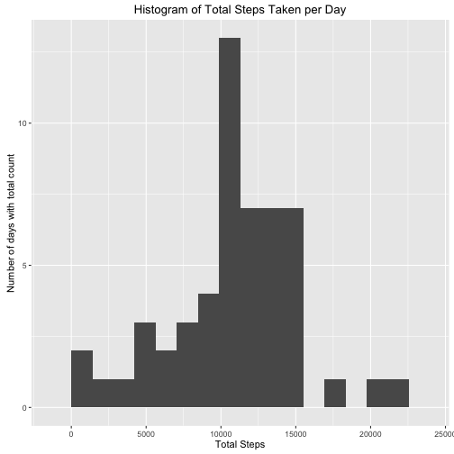

#Course Project 1
###_author: Clinton Olson_
###_date: January 20, 2016_

This is an R Markdown document for Project 1 of the Coursera Reproducible Research course.  The purpose of this initial project is to gain experience with literate programming methods to produce a report that explores the activity monitoring data set obtained from the following link: https://d396qusza40orc.cloudfront.net/repdata%2Fdata%2Factivity.zip.

### Loading the data set

First, we load the data by reading directly from the csv file obtained from the link mentioned above.


```r
activityData <- read.csv("../data/activity.csv", header = TRUE)
```

At the present moment, the data will not be transformed or altered in any way.

### Mean steps per day

In this section we examine the number of steps taken per day.

First, lets get the steps by day and display the result:


```r
stepsPerDay <- aggregate(steps ~ date, data = activityData, sum)
print(stepsPerDay)
```

```
##          date steps
## 1  2012-10-02   126
## 2  2012-10-03 11352
## 3  2012-10-04 12116
## 4  2012-10-05 13294
## 5  2012-10-06 15420
## 6  2012-10-07 11015
## 7  2012-10-09 12811
## 8  2012-10-10  9900
## 9  2012-10-11 10304
## 10 2012-10-12 17382
## 11 2012-10-13 12426
## 12 2012-10-14 15098
## 13 2012-10-15 10139
## 14 2012-10-16 15084
## 15 2012-10-17 13452
## 16 2012-10-18 10056
## 17 2012-10-19 11829
## 18 2012-10-20 10395
## 19 2012-10-21  8821
## 20 2012-10-22 13460
## 21 2012-10-23  8918
## 22 2012-10-24  8355
## 23 2012-10-25  2492
## 24 2012-10-26  6778
## 25 2012-10-27 10119
## 26 2012-10-28 11458
## 27 2012-10-29  5018
## 28 2012-10-30  9819
## 29 2012-10-31 15414
## 30 2012-11-02 10600
## 31 2012-11-03 10571
## 32 2012-11-05 10439
## 33 2012-11-06  8334
## 34 2012-11-07 12883
## 35 2012-11-08  3219
## 36 2012-11-11 12608
## 37 2012-11-12 10765
## 38 2012-11-13  7336
## 39 2012-11-15    41
## 40 2012-11-16  5441
## 41 2012-11-17 14339
## 42 2012-11-18 15110
## 43 2012-11-19  8841
## 44 2012-11-20  4472
## 45 2012-11-21 12787
## 46 2012-11-22 20427
## 47 2012-11-23 21194
## 48 2012-11-24 14478
## 49 2012-11-25 11834
## 50 2012-11-26 11162
## 51 2012-11-27 13646
## 52 2012-11-28 10183
## 53 2012-11-29  7047
```

Now, lets take a look at the histogram of steps per day by date:


```r
require(ggplot2)
ggplot(stepsPerDay, aes(steps)) + 
  geom_histogram(bins = 15) + 
  ggtitle("Histogram of Total Steps Taken per Day") + 
  labs(x="Total Steps", y = "Number of days with total count")
```



Now we can look at the mean and median values for steps per day:


```r
mean(stepsPerDay$steps, na.rm = TRUE)
```

```
## [1] 10766.19
```

```r
median(stepsPerDay$steps, na.rm = TRUE)
```

```
## [1] 10765
```
From the above, we can see that when removing NA values, we see a mean and median steps per day of 10766.19 and 10765 respectively

### Average daily activity pattern

In this section we take a look at the average daily activity pattern for the individual in this dataset.

Let's look at a time series plot:


```r
meanStepsPerInterval <- aggregate(steps ~ interval, data = activityData, FUN = mean)
ggplot(meanStepsPerInterval, aes(x = interval, y = steps)) +
  geom_line() + ggtitle("Mean steps for each 5-minute time interval in a day") + 
  labs(x = "Beginning of 5-min interval", y = "Mean steps per interval")
```


Upon examination, it would appear that the maximum mean number of steps are taken around the 820th 5-min time interval at just over 200 steps.  

Lets find out exactly which interval it is:


```r
meanStepsPerInterval[which.max(meanStepsPerInterval$steps), ]
```

```
##     interval    steps
## 104      835 206.1698
```
From this we can see that the maximum mean number of steps taken for any 5-min interval in the day are 206.1698 on time interval 835.

### Imputing missing values

In the previous steps we removed missing values from our calculations.  Now we will impute the missing values with what we hope are a reasonable substitution.

Let's first see how many missing values we have:


```r
sum(is.na(activityData$steps))
```

```
## [1] 2304
```

Okay, so there are 2304 missing values that we need to fill in.  The strategy we will take here is to fill in missing values with the mean value for the time interval in question.  This is simple, but probably not the most accurate way of imputing the values.  We might instead prefer drawing from a distribution of some kind.  However, this will do for now.


```r
# copy the dataset and impute the missing values
actDataImputed <- activityData
for(i in 1:nrow(actDataImputed))
{
  if(is.na(actDataImputed$steps[i]))
  {
    actDataImputed$steps[i] = meanStepsPerInterval[meanStepsPerInterval$interval == actDataImputed$interval[i], c("steps")]
  }
}

# now lets make a histogram and find the mean/median values with the new imputed dataset
stepsPerDayImputed <- aggregate(steps ~ date, data = actDataImputed, sum)
ggplot(stepsPerDayImputed, aes(steps)) + 
  geom_histogram(bins = 15) + 
  ggtitle("Histogram of Total Steps Taken per Day w/ Imputed values") + 
  labs(x="Total Steps", y = "Number of days with total count")
```


```r
mean(stepsPerDayImputed$steps)
```

```
## [1] 10766.19
```

```r
median(stepsPerDayImputed$steps)
```

```
## [1] 10766.19
```

So it would appear that imputing the missing values only marginally changes the median value and leaves the mean unchanged.  The histogram is also very similar in its appearance, with the number of days with the total step counts has increased for each bin, but the overall shape looks rather unchanged.


